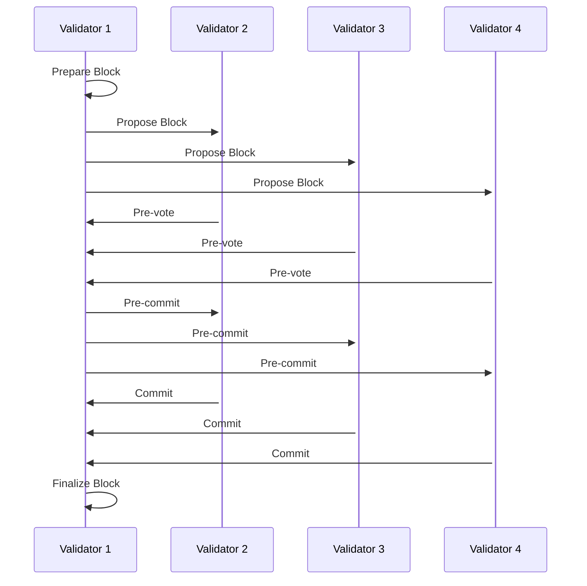

# CC Chain Architecture

## Overview

CC Chain is designed as a modular, high-performance blockchain platform with a focus on scalability, security, and developer experience. The architecture follows a layered approach with clear separation of concerns.

## System Architecture

```
┌─────────────────────────────────────────────────────────────┐
│                    Application Layer                        │
├─────────────────────────────────────────────────────────────┤
│  CLI Tools  │  SDK  │  API Server  │  Block Explorer      │
├─────────────────────────────────────────────────────────────┤
│                    Interface Layer                          │
├─────────────────────────────────────────────────────────────┤
│  RPC Interface  │  REST API  │  WebSocket  │  Metrics     │
├─────────────────────────────────────────────────────────────┤
│                    Service Layer                            │
├─────────────────────────────────────────────────────────────┤
│  Validator  │  Indexer  │  Bridge  │  Wallet  │ Monitor   │
├─────────────────────────────────────────────────────────────┤
│                     Core Layer                              │
├─────────────────────────────────────────────────────────────┤
│  Consensus (ccBFT)  │  Smart Contracts  │  Networking     │
├─────────────────────────────────────────────────────────────┤
│                   Foundation Layer                          │
├─────────────────────────────────────────────────────────────┤
│  Core Blockchain  │  Storage  │  Cryptography  │  Utilities │
└─────────────────────────────────────────────────────────────┘
```

## Core Components

### 1. Core Blockchain (`cc-core`)

The foundation layer containing essential blockchain primitives:

- **Block Structure**: Contains transactions, state root, and metadata
- **Transaction System**: Flexible transaction types with gas mechanism
- **State Management**: Merkle tree-based state with efficient updates
- **Cryptography**: Ed25519 signatures with Blake3 hashing
- **Error Handling**: Comprehensive error types for all operations

#### Key Data Structures

```rust
pub struct Block {
    pub header: BlockHeader,
    pub transactions: Vec<Transaction>,
}

pub struct BlockHeader {
    pub prev_hash: Hash,
    pub height: u64,
    pub timestamp: u64,
    pub proposer: CCPublicKey,
    pub tx_merkle_root: Hash,
    pub state_root: Hash,
    pub gas_used: u64,
    pub gas_limit: u64,
}
```

### 2. Consensus (`consensus`)

Advanced Byzantine Fault Tolerant consensus with ccBFT enhancement:

- **ccBFT Algorithm**: Configurable BFT with adaptive parameters
- **Safety System**: Multi-layered fault detection and recovery
- **Validator Management**: Dynamic validator set with staking
- **Performance Optimization**: Pipelined processing and fast finality

#### ccBFT Features

- **Adaptive Timeouts**: Dynamic adjustment based on network conditions
- **Byzantine Tolerance**: Handles ⌊(n-1)/3⌋ malicious validators
- **Fast Finality**: Single-slot finality for most transactions
- **Upgrade Capability**: Seamless transition from standard BFT

### 3. Networking (`networking`)

P2P networking and cross-chain bridge functionality:

- **P2P Protocol**: Libp2p-based networking with gossip protocols
- **Bridge System**: Cross-chain asset transfers and messaging
- **Peer Management**: Discovery, connection management, and health monitoring
- **Message Routing**: Efficient propagation of blocks and transactions

#### Bridge Architecture

```
┌──────────────┐    ┌──────────────┐    ┌──────────────┐
│   Ethereum   │◄──►│  CC Chain    │◄──►│   Bitcoin    │
│   Bridge     │    │   Bridge     │    │   Bridge     │
└──────────────┘    └──────────────┘    └──────────────┘
       │                     │                     │
       ▼                     ▼                     ▼
┌──────────────┐    ┌──────────────┐    ┌──────────────┐
│   ERC-20     │    │   Native     │    │    BTC       │
│   Tokens     │    │   Assets     │    │   Wrapping   │
└──────────────┘    └──────────────┘    └──────────────┘
```

### 4. Storage (`storage`)

Efficient storage layer with caching and mempool:

- **Blockchain Storage**: Persistent block and state storage
- **Mempool**: Transaction pool with priority ordering
- **Caching**: LRU cache for frequently accessed data
- **Indexing**: Fast lookups for blocks, transactions, and accounts

### 5. Smart Contracts (`contracts`)

WebAssembly-based smart contract execution environment:

- **WASM Runtime**: High-performance contract execution
- **Gas Metering**: Resource usage tracking and limiting
- **State Interface**: Contract interaction with blockchain state
- **Standard Library**: Common contract utilities and interfaces

## Node Types

### Validator Node

Full participation in consensus with block production capabilities:

- Maintains complete blockchain state
- Participates in ccBFT consensus
- Proposes and validates blocks
- Earns staking rewards
- Requires staked tokens

### Light Compute Node  

Lightweight node with computational capabilities:

- Syncs block headers and minimal state
- Can execute smart contracts
- Provides RPC services
- Suitable for DApp backends
- Lower resource requirements

### Wallet Node

Transaction-focused lightweight node:

- Syncs relevant transactions only
- Maintains user account state
- Submits transactions to network
- Minimal computational overhead
- Ideal for end-user applications

## Consensus Flow



## Performance Characteristics

### Throughput

- **Target TPS**: 5,000+ transactions per second
- **Block Time**: 3-6 seconds (adaptive)
- **Finality**: Single-slot for most transactions
- **Gas Limit**: Configurable per block

### Scalability

- **Horizontal Scaling**: Adding more validators increases security
- **State Sharding**: Future enhancement for increased capacity
- **Cross-Chain**: Bridge to external networks for expanded ecosystem
- **Layer 2**: Support for rollups and sidechains

### Resource Requirements

| Node Type | CPU | RAM | Storage | Bandwidth |
|-----------|-----|-----|---------|-----------|
| Validator | 4+ cores | 8+ GB | 1+ TB SSD | 100+ Mbps |
| Light Compute | 2+ cores | 4+ GB | 100+ GB | 50+ Mbps |
| Wallet | 1+ core | 2+ GB | 10+ GB | 10+ Mbps |

## Security Model

### Cryptographic Foundations

- **Signatures**: Ed25519 for fast, secure signing
- **Hashing**: Blake3 for high-performance cryptographic hashing
- **Merkle Trees**: Efficient state and transaction verification
- **Random Number Generation**: Cryptographically secure randomness

### Consensus Security

- **Byzantine Fault Tolerance**: Secure against ⌊(n-1)/3⌋ malicious validators
- **Slashing**: Economic penalties for malicious behavior
- **Validator Monitoring**: Real-time detection of misbehavior
- **Network Partitioning**: Automatic detection and recovery

### Smart Contract Security

- **Deterministic Execution**: Consistent results across all nodes
- **Gas Metering**: Prevention of infinite loops and resource exhaustion
- **Sandboxing**: Isolated execution environment
- **Formal Verification**: Support for provably correct contracts

## Development Philosophy

### Modularity

Each component is designed as an independent crate with clear interfaces:

- Enables parallel development
- Facilitates testing and debugging
- Allows for component-specific optimizations
- Supports future architectural changes

### Performance

Rust's zero-cost abstractions and memory safety enable:

- High-performance consensus algorithms
- Efficient memory usage
- Minimal runtime overhead
- Safe concurrent programming

### Developer Experience

Focus on ease of use and comprehensive tooling:

- Rich SDK with multiple language bindings
- Comprehensive documentation and examples
- Powerful CLI tools for all operations
- Real-time metrics and monitoring

## Future Roadmap

### Short Term (3-6 months)

- [ ] Enhanced smart contract capabilities
- [ ] Additional bridge implementations
- [ ] Performance optimizations
- [ ] Mobile SDK development

### Medium Term (6-12 months)

- [ ] State sharding implementation
- [ ] Layer 2 scaling solutions
- [ ] Advanced governance mechanisms
- [ ] Cross-chain DeFi protocols

### Long Term (12+ months)

- [ ] Zero-knowledge proof integration
- [ ] Quantum-resistant cryptography
- [ ] Advanced privacy features
- [ ] Enterprise-grade tooling

## Conclusion

CC Chain's architecture is designed for the demands of modern blockchain applications, providing the performance, security, and developer experience needed for next-generation decentralized systems. The modular design ensures the platform can evolve and adapt to future requirements while maintaining backward compatibility and security.